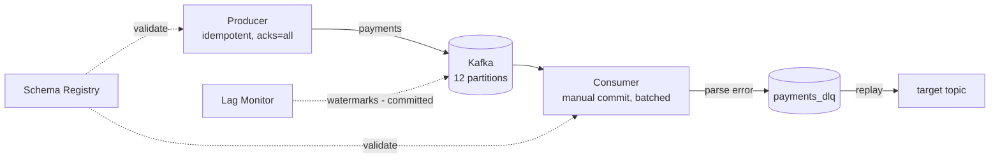

# kafka-event-streaming

> Event-driven microservice backbone on Apache Kafka — idempotent producers, manual-commit batch consumers, a dead-letter queue with replay, consumer-lag monitoring, and Schema Registry integration.


---

## Overview / Aim

This repository implements the reusable plumbing for a **payment-events streaming
platform** on Kafka. Beyond the happy-path produce/consume cycle, it tackles the
parts that determine whether an event pipeline survives production: **exactly-once
producer semantics**, **at-least-once consumption with explicit offset control**,
a **dead-letter queue (DLQ)** for poison messages, **replay** to recover from
those failures, **lag monitoring** to catch falling-behind consumers, and
**schema governance** via Confluent Schema Registry.

## Architecture / How It Works



- **Producer** keys events by `user_id` (co-locating a user's events on one
  partition) with `enable.idempotence=True`, `acks=all`, and snappy compression.
- **Consumer** disables auto-commit and commits **only after** a batch is
  successfully handled — at-least-once delivery without losing in-flight work.
- **DLQ** wraps each poison message with its error, source topic, and timestamp;
  **replay** drains the DLQ back into a target topic.
- **Lag monitor** computes `high_watermark − committed_offset` per
  topic-partition via the Admin + Consumer APIs.

## Tech Stack & Tools

| Tool | Role |
|------|------|
| **Apache Kafka 7.5 (Confluent)** | Event broker (Zookeeper-backed) |
| **confluent-kafka (Python)** | Producer / Consumer / AdminClient |
| **Schema Registry** | Subject/version schema governance over REST |
| **requests** | Schema Registry HTTP client |
| **Docker Compose** | Local Kafka + Zookeeper (12 default partitions) |
| **pytest + unittest.mock** | Serialisation, DLQ, and lag unit tests |

## Project Structure

```
kafka-event-streaming/
├── src/
│   ├── producer.py         # PaymentEvent dataclass + idempotent producer (acks=all, snappy)
│   ├── consumer.py         # manual-commit, batched consume loop (at-least-once)
│   ├── dlq.py              # send_to_dlq: wrap poison msg w/ error + source + ts
│   ├── replay.py           # replay_dlq: drain DLQ → target topic
│   ├── lag_monitor.py      # get_consumer_lag: watermark − committed per partition
│   └── schema_registry.py  # SchemaRegistry: get/register subjects & versions
├── tests/
│   ├── test_events.py      # event serialisation + DLQ payload shape
│   └── test_lag.py         # lag computation (mocked Admin/Consumer)
├── docs/
│   └── topics.md           # naming, partitioning & retention conventions
└── docker-compose.yml      # Kafka 7.5 + Zookeeper
```

## Key Features / Highlights

- **Idempotent producer** — `acks=all` + `enable.idempotence` + snappy compression
  for safe, efficient writes; per-event delivery callbacks report offsets/errors.
- **Manual offset management** — the consumer commits only after a full batch is
  handled, giving at-least-once semantics with bounded reprocessing.
- **Dead-letter queue + replay** — poison messages are quarantined with full
  context and can be re-driven into any target topic up to a `max_msgs` bound.
- **Consumer-lag observability** — per-partition lag derived from watermarks vs.
  committed offsets, ready to feed a dashboard or alert.
- **Schema governance** — register and fetch schemas by subject/version against
  Confluent Schema Registry.
- **Documented topic conventions** — `<domain>.<entity>.<event>` naming,
  `user_id` partition keying, 7-day main / 30-day DLQ retention (`docs/topics.md`).

## Challenges

- **Delivery guarantees** — combining idempotent production with manual,
  post-batch commits to avoid both data loss and unbounded duplicates.
- **Poison-message handling** — a single un-parseable record must not stall a
  partition; the DLQ + replay loop isolates and recovers it.
- **Lag visibility** — correctly pairing Admin-reported partitions with committed
  offsets and watermarks, including the `None`-offset edge case.

## Future Work

- Avro/Protobuf payloads validated through Schema Registry (currently JSON).
- Exactly-once end-to-end via Kafka transactions.
- Prometheus exporter for the lag monitor + Grafana dashboard.
- Configurable retry/backoff before DLQ routing.
- KRaft mode (drop Zookeeper).

## Getting Started / Usage

```bash
# 1. Start Kafka + Zookeeper
docker-compose up -d

# 2. Install the client
pip install confluent-kafka requests pytest

# 3. Produce an event
python -c "from src.producer import *; \
p=make_producer(); \
emit(p,'payments',PaymentEvent('e1','u1',49.99,'USD','completed','2024-01-01T00:00:00Z')); \
p.flush()"

# 4. Consume
python -c "from src.consumer import make_consumer, consume_loop; \
c=make_consumer('localhost:9092','grp',['payments']); \
consume_loop(c, print)"

# 5. Run tests
pytest tests/ -v
```

## Conclusion

Demonstrates production-grade **event-streaming engineering** on Kafka:
idempotent delivery, explicit offset control, dead-letter + replay recovery, lag
observability, and schema governance — the failure-handling concerns that
separate a demo from a real streaming backbone.
